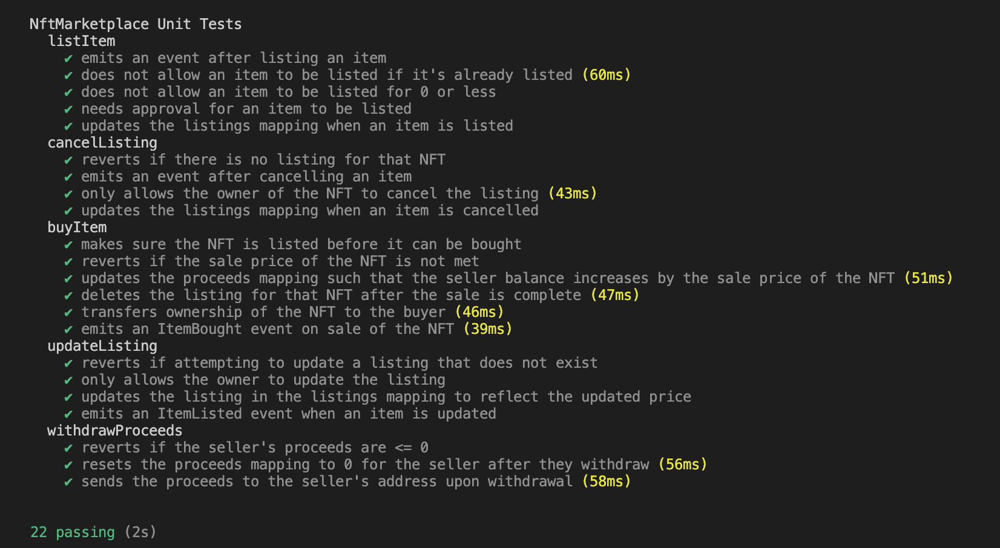

# Hardhat NFT Marketplace

## About

- An NFT marketplace for trading ERC-721 tokens.

## Technology Stack & Tools

- Solidity (Writing Smart Contract)
- Javascript (Testing)
- [Ethers](https://docs.ethers.io/v5/) (Blockchain Interaction)
- [Hardhat](https://hardhat.org/) (Development Framework)

## Requirements For Initial Setup
- Install [NodeJS](https://nodejs.org/en/), should work with any node version below 16.5.0
- Install [Hardhat](https://hardhat.org/)

## Setting Up
### 1. Clone/Download the Repository

### 2. Install Dependencies:
```
$ cd Hardhat-NFT-Marketplace
$ npm install 
```

### 3. Compile Contracts
`$ npx hardhat compile`

### 4. Run Tests
`$ npx hardhat test`


